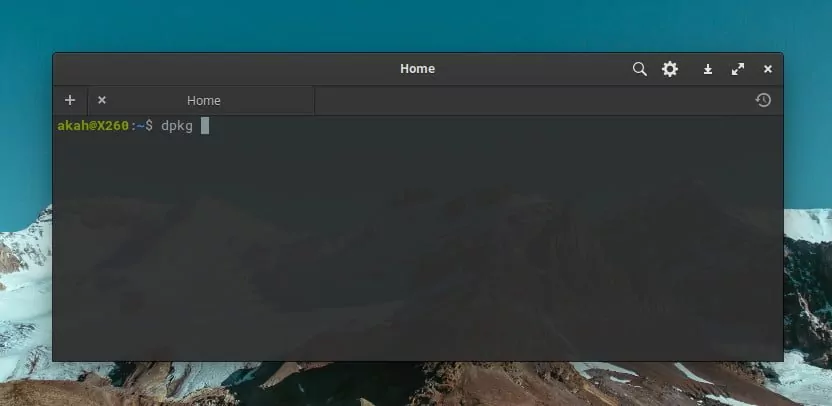

DPKG merupakan pengelola paket (package manager) untuk OS Linux berbasis Debian yang salah satu turunannya adalah ubuntu. dpkg bisa digunakan untuk menginstal, menghapus, dan membuild sebuah paket.<!--truncate--> Namun tidak seperti sistem manajemen paket lainnya, dpkg tidak bisa mengunduh dan menginstal paket beserta dependensinya secara otomatis.

Jadi jika paket yang kita install memiliki dependensi terhadap paket lain yang belum ada di sistem kita maka kita harus menginstal paket dependensi tersebut terlebih dahulu.

Contoh paket yang memiliki dependensi adalah paket libgoo-canvas-perl, ia memiliki dependensi terhadap paket libgoocanvas3 dan libgoocanvas3 pun memiliki dependensi, yaitu terhadap paket libgoocanvas-common. Nah untuk kasus ini maka urutan yg harus diinstall terlebih dahulu adalah:

`libgoocanvas-common` -> `libgoocanvas3` -> `libgoo-canvas-perl`.

Contoh di atas saya alami saat saya harus menginstall libgoo-canvas-perl yang dikarenakan oleh tombol Edit pada aplikasi Shutter saya tidak aktif.

OK, pada tulisan kali ini saya akan share mengenai penggunaan dpkg untuk mengelola paket yang diinstal secara lokal:

Untuk melihat paket apa saja yang terinstal pada sistem, gunakan perintah berikut pada terminal:

```bash 
dpkg -l
```

Perintah di atas mungkin akan menghasilkan output dalam bentuk list yang panjang sehingga kita sulit untuk melihatnya satu persatu, namun tidak usah khawatir karena kita bisa menggunakan grep untuk melihat apakah paket yang kita cari terinstal atau tidak:

```bash 
dpkg -l | grep apache2
```

Contoh di atas adalah untuk pengecekan terhadap paket apache2, silahkan ganti apache2 dengan nama paket yang ingin dicari, nama paket bisa lengkap atau bisa juga dengan menggunakan bagian dari nama paketnya, misal apache2 pada contoh di atas diganti dengan apache saja, jadi penulisan nama paket tidak harus lengkap ya gaes. Selain itu kita juga bisa mencari menggunakan ekspresi regular (regex).

Untuk melihat list file apa saja yang diinstal oleh sebuah paket, kita bisa gunakan dpkg -L. berikut adalah contoh perintah untuk melihat file apa saja yang dinstal oleh paket ufw:

```bash 
dpkg -L ufw
```

Saat kita tidak yakin sebuah file diinstall oleh paket yang mana, kita bisa gunakan dpkg -S untuk memeriksanya. Sebagai contoh:

```bash 
dpkg -S /etc/host.conf
```

Hasil dari perintah diatas adalah base-files: /etc/host.conf, yang artinya menunjukkan bahwa /etc/host.conf termasuk dalam paket file dasar.
Selama proses instalasi ada banyak file yang dibuat secara otomatis oleh paket, dan meskipun berada di sistem file terkadang dpkg -S tidak tahu file tersebut dari paket mana.

Ini perintah dpkg yang paling sering saya pakai, yup.. untuk menginstal file .deb yang sudah download sebelumnya, misalnya menginstal google chrome menggunakan file google-chrome-stable_current_amd64.deb yang telah saya download dari https://www.google.com/intl/id_id/chrome/:

```bash 
sudo dpkg -i google-chrome-stable_current_amd64.deb
```

silahkan ubah google-chrome-stable_current_amd64.deb ke nama file sebenarnya dari file .deb lokal yang ingin diinstal.

Ini perintah yang dpkg yang nggak pernah saya pakai, yaitu dpkg -r nama_paker yang berfungsi untuk menghapus instalasi paket, berikut contohnya:

```bash 
sudo dpkg -r zip
```

Menghapus instalasi paket menggunakan dpkg, dalam banyak kasus, TIDAK disarankan. Lebih baik menggunakan package manager lain yang bisa menangani dependensi untuk memastikan bahwa sistem dalam keadaan konsisten. Jika kita menggunakan dpkg -r zip seperti contoh di atas maka akan menghapus paket zip saja, tetapi paket apa pun yang bergantung padanya akan tetap diinstal dan mungkin tidak lagi berfungsi dengan benar.

Informasi lebih banyak mengenai opsi-opsi dpkg silahkan lihat halaman manual dengan cara mengetik perintah berikut:

```bash 
man dpkg
```

Demikian ulasan singkat mengenai penggunaan DPKG pada Ubuntu 18.04 yang diperlukan untuk mengelola paket yang diinstal secara lokal, semoga bermanfaat.